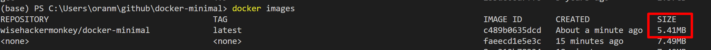

# docker-minimal
 create a minimal docker image with nothing in it but the app


# build the cpp file (powershell)
```bash
docker run --rm -it -v ${PWD}:/build ubuntu:16.04
container# apt-get update && apt-get install build-essential
container# cd /build
container# gcc -o hello -static -nostartfiles hello.c

or 
docker run --rm -v ${PWD}:/usr/src/myapp -w /usr/src/myapp gcc:4.9 gcc -o hello -static -nostartfiles ./build/hello.c

```

# Build docker image [gcc - Docker Hub](https://hub.docker.com/_/gcc/)
```bash

docker run --rm -v ${PWD}:/usr/src/myapp -w /usr/src/myapp gcc:4.9 gcc -o hello -static -nostartfiles ./build/hello.c
docker build -t wisehackermonkey/docker-minimal:latest .
docker run  --rm wisehackermonkey/docker-minimal:latest
```
# publish to docker 
```bash
docker login
docker push wisehackermonkey/docker-minimal:latest
```

# expirment with golang
### build script [golang - Docker Hub](https://hub.docker.com/_/golang)
```bash
# docker run --rm -v ${PWD}:/usr/src/myapp -w /usr/src/myapp golang:1.14 go build  -v ./build/hello-world.go 
docker run --rm -v ${PWD}:/usr/src/myapp -w /usr/src/myapp -e  CGO_ENABLED=0 -e GOOS=linux -e GOARCH=amd64 golang:1.14 go build cgo -ldflags="-w -s"  -v ./build/hello-world.go   


docker build -f Dockerfile.go -t wisehackermonkey/docker-minimal:latest .
docker run -it --rm -p 8090:8090 wisehackermonkey/docker-minimal:latest
```


# NOTES:
### images size is really small!

### weird by product of using from scratch
```
ctrl + c doesnt work because there is no shell
```


# Rust
### 
```bash
docker run --rm  -v ${PWD}:/usr/src/myapp -w /usr/src/myapp rust:1.23.0 rustc ./hello.rs -o ./hello

docker build -t wisehackermonkey/docker-minimal:rust .
docker run -it --rm -p 8090:8090 wisehackermonkey/docker-minimal:rust
```